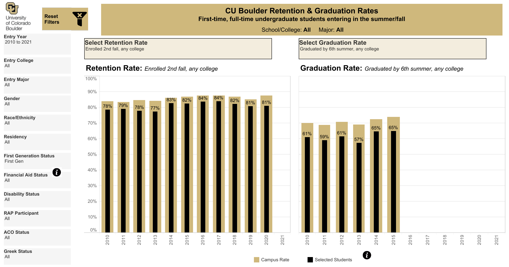
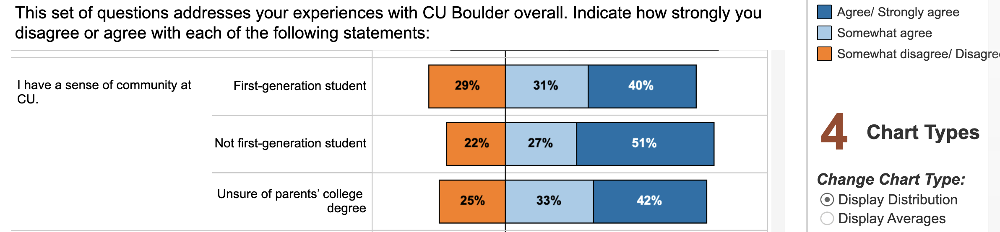
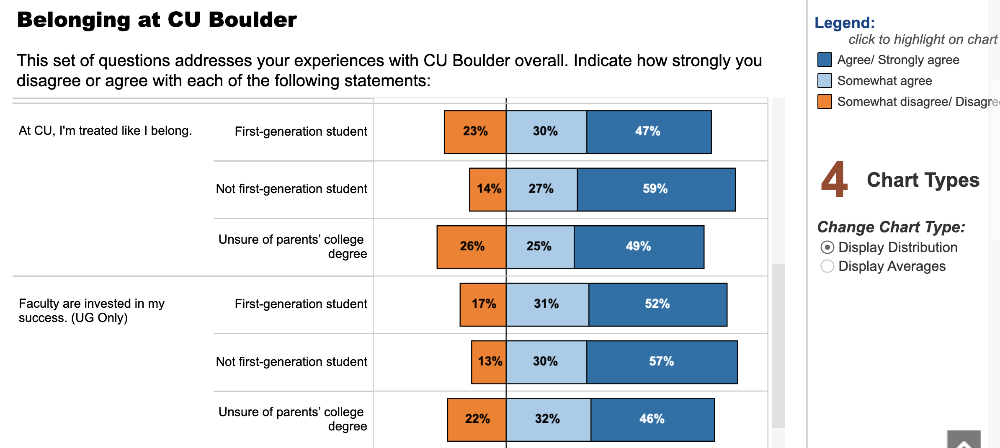
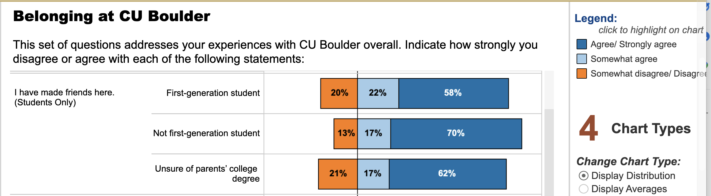

class: inverse, left, top
```{r load_packages, message=FALSE, warning=FALSE, include=FALSE} 
library(fontawesome)
```
### About Me

####  `r fa("address-card", fill = "steelblue")` Interim Chief Data Officer, University of Colorado Boulder

####  `r fa("university", fill = "steelblue")`     20 years experience in higher education
####  `r fa("school", fill = "steelblue")`     15 years on campus (Kansas, Vanderbilt, Minnesota, Colorado)
####  `r fa("database", fill = "steelblue")`     5 years in Ed-Tech/Consultancy
####  `r fa("laptop-code", fill = "steelblue")`     13 years Higher Ed Analytics/Data Science 

### Contact
####  `r fa("envelope", fill = "steelblue")`   brad.weiner@colorado.edu
####  `r fa("twitter", fill = "steelblue")`    brad_weiner
####  `r fa("desktop", fill = "steelblue")`    bradweiner.info
---
class: center, middle
background-image: url(images/elite_college.jpeg)
background-size: contain
### What Does a Research University Do?
---
class: inverse, center, middle
--

####  `r fa("check-circle", fill = "green")` Create new knowledge in the form of academic research, scholarly output, and creative works

--

####  `r fa("check-circle", fill = "green")` Teach undergraduate and graduate students so they can be engaged members of society and informed, participatory citizens in a democracy

--

####  `r fa("check-circle", fill = "green")` Generate credentials to signal to society and the labor market that graduates have achieved certain skills

--

####  `r fa("check-circle", fill = "green")` Engage with the public in order to be broadly useful to society and so we may create economic and social value

--

####  `r fa("check-circle", fill = "green")` Play football

--

####  `r fa("check-circle", fill = "green")` Preserve knowledge through libraries, archives, curation, and art

--
####  `r fa("check-circle", fill = "green")` Heal patients and create life-improving treatments

--
####  `r fa("check-circle", fill = "green")` Act as an economic engine for local and global businesses

--
####  `r fa("check-circle", fill = "green")` Other stuff that we haven't even listed here

---
class: center, middle
background-image: url(images/graduate.jpeg)
background-size: contain
### Who Does a University Serve?
---
class: inverse, center, middle
--

####  `r fa("check-circle", fill = "green")` Students

--

####  `r fa("check-circle", fill = "green")` Faculty

--

####  `r fa("check-circle", fill = "green")` Staff

--

####  `r fa("check-circle", fill = "green")` The Public

--

####  `r fa("check-circle", fill = "green")` Alumni, Friends, Fans, and Donors

--

####  `r fa("check-circle", fill = "green")` The Economy

--

####  `r fa("check-circle", fill = "green")` Its Local Community

---
class: center, middle
background-image: url(images/goals.jpg)
background-size: contain
 
--
### Universities have diffuse and sometimes competing goals

--
### Universities have myriad stakeholders

--
### Universities have to demonstrate our value to taxpayers and to society

--
### Universities are resource constrained
---
class: center, top
background-image: url(images/python.jpg)
background-size: contain
--
### If we don't use data or existing research, we're guessing

--
### If we're guessing, we're biased toward the status quo

--
### If we resort to the status quo, we can't move forward
---
class: inverse, center, middle
--
.pull-left[

#### Universities use data as a "mirror" to see how we're doing

```{r echo=FALSE, message=FALSE, warning=FALSE, out.width= "100%", paged.print=FALSE}
include_graphics("images/mirror_1.jpg") 
```

]

--
.pull-right[

#### Universities use data as a "flashlight" to find areas for improvement

```{r echo=FALSE, message=FALSE, warning=FALSE, out.width= "100%", paged.print=FALSE}
 
```
]
---
class: center, middle
background-image: url(images/mirror_1.jpg)
background-size: contain
### Descriptive Statistics and Reporting
---
class: center, middle
```{r echo=FALSE, message=FALSE, warning=FALSE, out.width= "100%", paged.print=FALSE}
include_graphics("images/retn_grad_1.png")
```

#### These are historical retention and graduation rates for CU Boulder for first-time, full-time undergraduates
---
class: center, middle
```{r echo=FALSE, message=FALSE, warning=FALSE, out.width= "100%", paged.print=FALSE}

```

#### These are historical retention and graduation rates for CU Boulder for first-time, full-time undergraduates who are ALSO first-generational 

#### It appears as though, on average, first-generational students are retained and graduate at a lower rate than peers whose parents attended college.
---
class: center, middle
background-image: url(images/flashlight.jpeg)
background-size: contain
### Data Science and Predictive Analytics
---
class: center, bottom
background-image: url(images/flashlight_2.jpg)
background-size: contain
### Research Question: Can we hypthesize why first-generational students graduate at lower rates?
---
class: inverse, left, top
### Compile the Raw Data (Not Real Data)
```{r echo=FALSE, message=FALSE, warning=FALSE, paged.print=FALSE}
library(kableExtra,quietly = T)
library(tidyverse,quietly = T)
library(magrittr,quietly = T)
d <- read.csv("data/retention_file_raw.csv",stringsAsFactors = F)
d <- d %>%
  mutate(first_gen = case_when(sex == "male" ~ "first_gen",
                               sex == "female" ~ "not_first_gen"),
         family_income = net_tuition) %>%
  select(-net_tuition) %>%
  as.data.frame(.)
td <- t(head(d))
colnames(td) <- NULL
kable(td) %>% column_spec(1,bold = TRUE,) %>% kable_styling(font_size = 14)
```
---
class: inverse,left, top
### Pre-Process the Data (Again Not Real Data)
```{r, echo=FALSE, message=FALSE, warning=FALSE}
library(fastDummies)
library(scales)
d <- dummy_columns(d)
d <- d %>% mutate_at(c("age","family_income","siblings_enrolled","peers_from_hs"), ~ scale(.))
d <- clean_names(d)
td <- t(head(d))
colnames(td) <- NULL
kable(td) %>% kable_styling(font_size = 13) %>% column_spec(1,bold = T)
```
---
class: inverse,center,middle
### Explore the Data (Again Not Real Data)
```{r echo=FALSE, message=FALSE, warning=FALSE}
library(tidyverse,quietly = T)
library(magrittr,quietly = T)
library(fromthebottom,quietly = T)
library(ggeasy,quietly = T)
p <- ggplot(d,aes(x=first_gen, y=family_income, fill=first_gen)) +
    geom_boxplot(outlier.shape = NA) +
    fromthebottom::scale_fill_phish(palette = "rift",discrete = T) +
    #geom_jitter(color="black", size=0.4) +
    theme_bw() +
    ggtitle("Distribution of Family Income (Scaled) by First-Gen Status -- FAKE DATA") +
    labs(y = "Family Income (Scaled)",x="First Gen Status")
p
```
---
class: inverse,center,middle
### Explore the Data (Again Not Real Data)
```{r echo=FALSE, message=FALSE, warning=FALSE}
library(ggcorrplot)
library(tidyverse)

d.num <- d %>%
    select_if(is.numeric) %>%
    select(-student_id) %>%
    as.data.frame(.)

#length(d.num)
#length(d)

corr <- round(cor(d.num), 1)
#corr

ggcorrplot(corr,type = "upper",
           ggtheme = ggplot2::theme_bw(),
           colors = fromthebottom::phish_palettes$picture_of_nectar[1:3])
```
---
class: inverse, left, top
### Model the Outcome: Split Into Test and Training Sets
```{r echo=FALSE, message=FALSE, warning=FALSE}
library(janitor)
set.seed(1876)

split <- initial_split(d, strata = retained)
retn_train <- training(split)
retn_test  <- testing(split)

kable(tabyl(retn_train$retained))

kable(tabyl(retn_test$retained))
```
---
class: inverse, left, top
### Model the Outcome: Build Basic Regression Model (This is Hacky and Poorly Specified)  
```{r echo=FALSE, message=FALSE, warning=FALSE, r,echo=T}
mod.1 <- glm(retained ~  #<<
               total_peer_group + #<<
               family_income + #<<
               first_gen_first_gen, #<<
             data = retn_train, #<<
             family = "binomial") #<<
```
---
class: inverse, left, top
### Review and Interpret the Results

```{r, echo=FALSE, message=FALSE, warning=FALSE}
# kable(exp(mod.1$coefficients),col.names = NULL) %>% kable_styling(font_size = 15)
options(scipen = 999)
kable(tidy(mod.1,exponentiate = TRUE),digits = 5) %>% kable_styling() %>%
  row_spec(4, bold = T, color = "white", background = "red") %>%
  row_spec(3, bold = T, color = "white", background = "green") %>%
  row_spec(2, bold = T, color = "white", background = "red")
```

--
#### Interpretation (Fake Data)

--
#### Being classifed as first-gen_first_gen is correlated with being 0.6 times less likely to be retained in the second year when controlling for other factors in the model.

--
#### For each additional 'unit' of family_income, a student is 2.11 times more likely to be retained in the second year when controlling for other factors in the model.
---
class: center, middle
background-image: url(images/mirror_1.jpg)
background-size: contain
### Surveys and Data Collection

#### Go Ask Them!
---
class: center, middle
```{r echo=FALSE, message=FALSE, warning=FALSE, out.width= "100%", paged.print=FALSE}

```

--
#### First-generational students disagree that they have a sense of community at CU Boulder 7% more than non-first-generational students.
---
class: center, middle
```{r echo=FALSE, message=FALSE, warning=FALSE, out.width= "100%", paged.print=FALSE}

```

--
#### First-generational students disagree that are treated like they belong 9% more than non-first-generational students.
---
class: center, middle
```{r echo=FALSE, message=FALSE, warning=FALSE, out.width= "100%", paged.print=FALSE}

```

--
#### First-generational students disagree that they have made friends here 7% more than non-first-generational students. 
---
class: center, bottom
background-image: url(images/flashlight_2.jpg)
background-size: contain
### Research Question: Can we understand why first-generational students graduate at lower rates?

--
### Research Answer: Yes! We have some pretty good clues


---
class: inverse, center, middle
--

####  `r fa("check-circle", fill = "green")` Retention and graduation are key indicators of student and institutional success

--

####  `r fa("check-circle", fill = "green")` Differential rates in retention and graduation are inequitable and demand attention

--

####  `r fa("check-circle", fill = "green")` Theoretical evidence posits many theories as to why first-generational students are less likely to persist until graduation.

--

####  `r fa("check-circle", fill = "green")` Our fake data and clunky model specification indiciated two things:  

--

####  `r fa("check-circle", fill = "green")` That family income is also highly correlated and something instistutions can impact through financial aid. And...

--

####  `r fa("check-circle", fill = "green")` That students from first-generational backgrounds feel less connected, less engaged and less likely to have friends or support.

--
####  `r fa("check-circle", fill = "green")` So what can we do about it?

---
class: center, middle
background-image: url(images/goals.jpg)
background-size: contain
 

### Universities have diffuse and sometimes competing goals


### Universities have myriad stakeholders


### Universities have to demonstrate our value to taxpayers and to society


### Universities are resource constrained
---
class: inverse, center, middle
--
.pull-left[


```{r echo=FALSE, message=FALSE, warning=FALSE, out.width= "100%", paged.print=FALSE}
include_graphics("images/mirror_1.jpg") 
```

]


.pull-right[


```{r echo=FALSE, message=FALSE, warning=FALSE, out.width= "100%", paged.print=FALSE}
 
```
]

### How Do We Use Data To Improve the University?

---
class: center, middle
background-image: url(images/roadmap.jpg)
background-size: contain
### Thinking deeply about what interventions the institution can control

### Predictive Models to efficiently allocate resources

### Data-informed policy briefs and recommendations

### Creating measurement and assessment plans to evaluate success
---
class: center, top
### We Need Your Help

--
#### The public and non-profit sectors need descriptive, predictive, and presriptive analytics to advance prosocial outcomes

--
#### These sectors aren't as far along as the private sector. This provides lots of room for innovation!

--
#### Find a business problem you care about. For me, that's helping colleges and universities, but there are endless ways to make a difference.
---
class: center, middle,inverse
background-image: url(images/blue_sky.jpg)
background-size: contain
### Some Blue Sky Projects in ODA and Higher Ed

--
#### NLP Model to Detect Incidents of Self-Harm in Survey Responses

--
#### IoT Experiment for Rapid, Random Surveys via Smart Phone

--
#### Deep Learning exploration of optimal curricular pathways

--
#### Recommender Systems for Courses, Instructors, Majors

--
#### Prescriptive Models for Guiding "Next Likely Action" for students and advisors

--
#### [Your Great Idea Here]
---
class: center, middle, inverse
background-image: url(images/mirror_1.jpg)
background-size: contain
#### Thank you: Marcos, Marie, Jordyn, Poom, Professor Larsen and the MSBA Team for the Invitation
#### This slide deck was created using R, Rmarkdown and the Xaringan Package
#### All photos are freely available from Unsplash.com
#### Errors, Typos, and Oopsies Are Mine. Please let me know if you see something wacky
#### Code and Slides available at
#### [bradweiner.info/talk](https://bradweiner.info/talk/)

